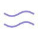
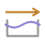
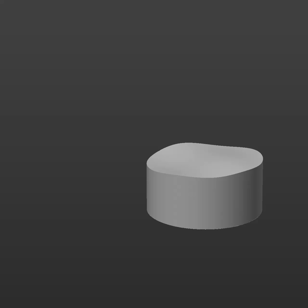

# EasyLiquid v1.3

Procedural fake liquid for Cinema 4D. Supports parametric cylinders and cubes.

  

Select your object, choose a mode, and create the liquid. Adjust the settings in one compact panel.

*EasyLiquid v1.3 running in Cinema 4D.*

## Install or update

Download the installation ZIP from [Releases](https://github.com/mooshmassacre/EasyLiquid/releases).

1. Close Cinema 4D.
2. Replace the previous EasyLiquid folder in your Cinema 4D plugins directory with the EasyLiquid folder from this package. Keep only one installed copy.
3. Restart Cinema 4D and open Extensions > EasyLiquid v1.3.

## Use

Select a cylinder or cube, choose Continuous Waves or Motion Response, and click Create / Update Liquid. Animate the original object or its parent Null. Adjust the controls and click Apply Changes. Select an existing liquid and use Load from Selection to read its settings.

Keep Surface Level in World Space compensates for container rotation while preserving waves. Motion Response uses keyframed Position on the object or its parents. Transition Lead starts the wave release earlier during a curved stop.

For existing scenes, select the liquid and click Create / Update Liquid to update its tag and translate its User Data. Values are retained. Save a copy of important scenes before updating.

## Animation modes

###  Continuous Waves

Creates a repeating wave animation driven by the timeline. The surface keeps moving even when the container stays still. Use this mode for a gently moving drink, a looping shot, or a stylized liquid surface that needs an ongoing rhythm.

- **Amplitude** controls the wave height.
- **Speed** controls how quickly the waves cycle.
- **Wavelength** controls the distance between wave peaks: longer waves make broader curves.
- **Direction** controls the wave orientation.
- **Secondary Ripples** adds smaller variations to the main wave.
- **Edge Lock** reduces deformation around the surface boundary.

**Quick start:** select a cylinder or cube, choose **Continuous Waves**, click **Create / Update Liquid**, and play the timeline. Adjust Amplitude and Speed, then click **Apply Changes**. Position keyframes are optional for this mode.

###  Motion Response (responsive liquid)

Responds to keyframed Position animation on the original container or its parent hierarchy. During movement, the liquid leans toward one side. As the container slows down or stops, the surface redistributes into waves that gradually settle. Use this mode for a cup sliding across a table, a moving product shot, or an animated container that should make its contents react.

- **Motion Strength** adjusts the overall response to movement.
- **Moving Tilt** sets the amount of surface inclination during movement.
- **Wave Rhythm** adjusts the pace of the settling oscillations.
- **Settling Time** controls how long the liquid takes to calm down.
- **Ripples** controls the smaller waves on the surface.
- **Wave Transition** controls how smoothly the moving tilt blends into the settling waves.
- **Transition Lead** brings that transition forward, useful when Position keyframes ease into a stop.

**Quick start:** choose **Motion Response**, click **Create / Update Liquid**, and animate the original cylinder, cube, or its parent Null with Position keyframes. Play through the movement and leave some time after the stop for the waves to settle. Adjust Moving Tilt and Settling Time, then click **Apply Changes**.

Both modes support **Keep Surface Level (World)** to compensate for container rotation while preserving the waves. They deform a fake liquid mesh; they do not simulate physical fluid or spills.

### Example

  

An animated example of EasyLiquid surface deformation. [Watch the original video](docs/EasyLiquid.mp4).

## v1.3 changes

English panel, User Data, mode names, messages, and help. Four separated sections, 12 px outer margins, compact 20 px icons, moderate row spacing, and paired settings buttons. Surface options share one row. Numeric inputs use a fixed 54 px width; sliders expand independently. Animation behavior is unchanged.

## Validation and limits

Source syntax checked. All 13 numeric input and slider pairs were checked for synchronization in both directions outside Cinema 4D. Layout uses native GeDialog grouping and spacing APIs documented by Maxon: https://developers.maxon.net/docs/py/2024_3_0/modules/c4d.gui/GeDialog/index.html
The preceding v1.1 engine was tested in Cinema 4D 2024.2.0. Native visual validation of this revised panel could not be completed in this session because UI automation could not focus the Script Manager.

This is an independent prototype, not affiliated with or endorsed by Maxon. Plugin ID 10691010 must be replaced with a registered Maxon ID before public distribution. It is a fake liquid mesh, without physical simulation or spills. Level compensation is intended for moderate container tilts.

## Source layout

- `EasyLiquid/EasyLiquid.pyp`: plugin registration.
- `EasyLiquid/plugin.py`: panel and commands.
- `EasyLiquid/engine.py`: geometry creation and embedded animation tag.
- `EasyLiquid/res/`: plugin and control icons.

Copy the `EasyLiquid` directory to your Cinema 4D plugins directory when installing from source. Do not run the `.pyp` file from Script Manager.

## Feedback

Report problems through Issues. Include your Cinema 4D version, the selected primitive, animation mode, reproduction steps, and any Python console error.

## License

EasyLiquid is licensed under the [MIT License](LICENSE).
